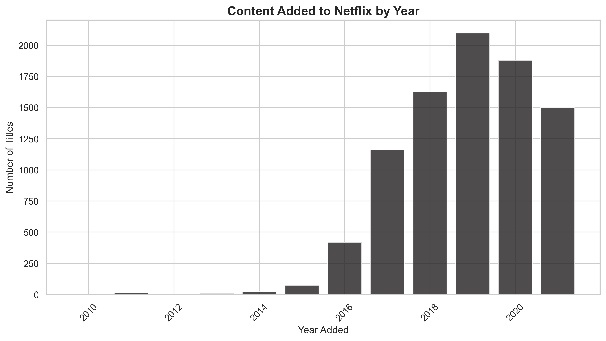
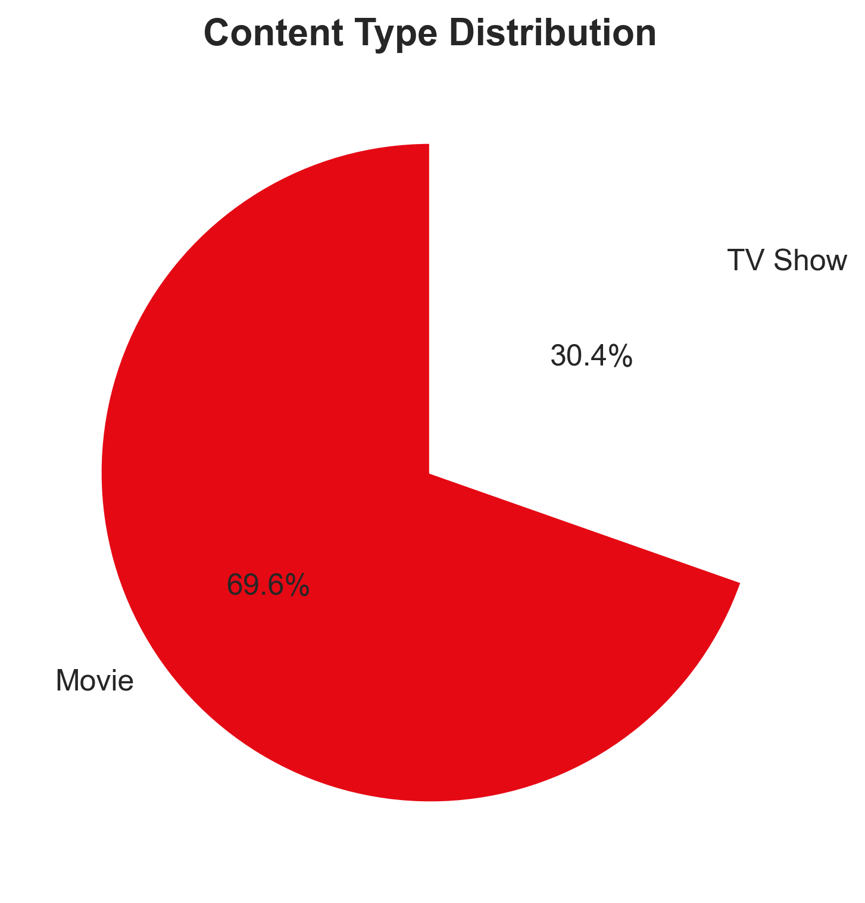
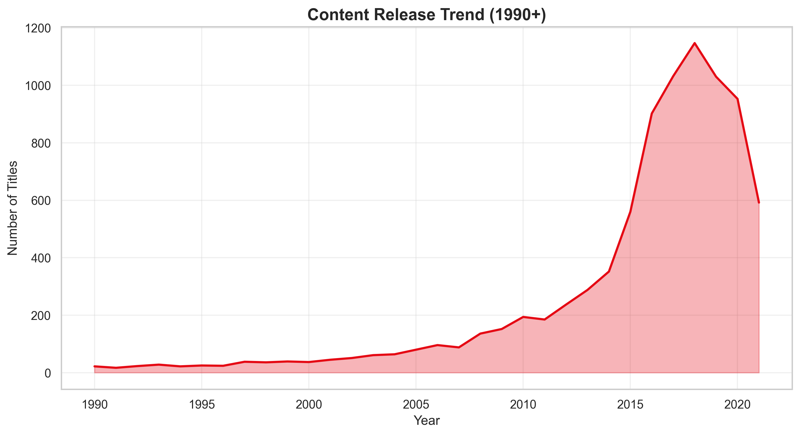
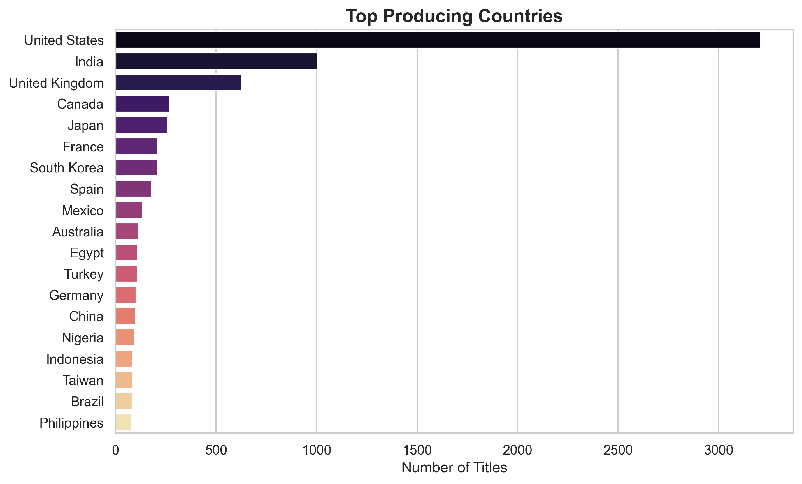
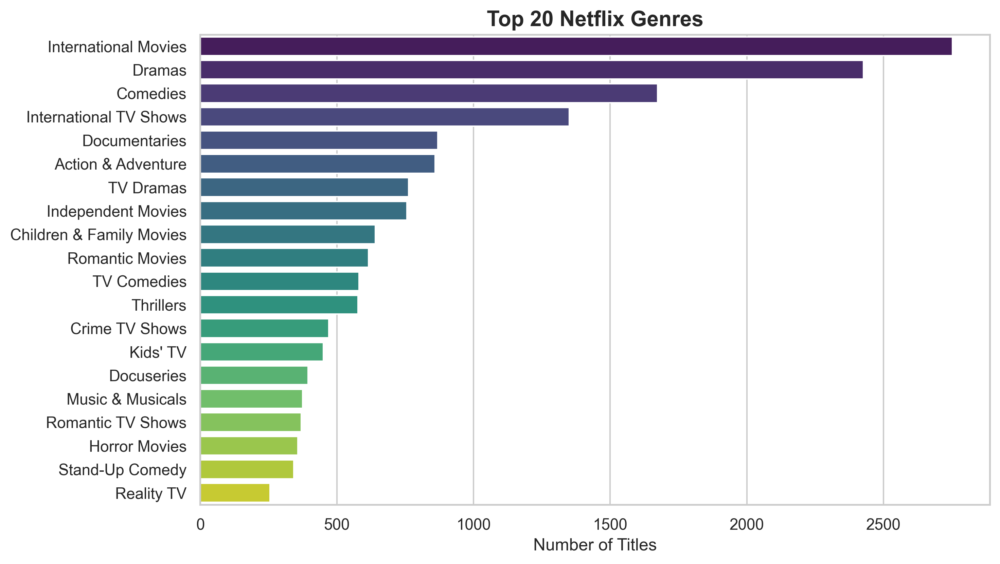

#  Netflix Recommendation System

โปรเจกต์ Data Science แบบ End-to-End ที่ครอบคลุมกระบวนการตั้งแต่การทำความสะอาดข้อมูล (Data Cleaning), การวิเคราะห์ข้อมูลเชิงสำรวจ (EDA), การสร้างระบบแนะนำคอนเทนต์ (Recommendation System) ด้วยเทคนิค NLP, และการเตรียมข้อมูลสำหรับทำ Dashboard บน Power BI
---


##  Requirements
```bash
pip install pandas numpy scikit-learn matplotlib seaborn mlflow joblib tqdm
```

หรือ
```bash
pip install -r requirements.txt
```

---

## 📁 Project Structure
```
netflix-recommendation/
├── data/
│   └── netflix_titles.csv          # วางไฟล์ CSV ที่นี่
├── src/
│   ├── load_data.py
│   ├── preprocess.py
│   ├── eda.py
│   ├── model_tfidf.py
│   ├── inference.py
│   └── export_powerbi.py
├── outputs/                         # ผลลัพธ์
├── main.py
├── analyze.py
└── export_recs.py
```

---

## 🚀 วิธีใช้งาน

### 1. เตรียมข้อมูล
```bash
# ดาวน์โหลด netflix_titles.csv
# วางไฟล์ใน data/netflix_titles.csv
```

### 2. รัน Pipeline หลัก
```bash
python main.py
```

**ผลลัพธ์:**
-  ทำความสะอาดข้อมูล
-  สร้างกราฟ 7 อันใน `outputs/plots/`
-  Export CSV สำหรับ Power BI
-  สร้างโมเดล TF-IDF

### 3. ทดสอบโมเดล
```bash
# แบบ Interactive
python analyze.py

# วิเคราะห์เรื่องเฉพาะ
python analyze.py "Stranger Things"
```

### 4. Export คำแนะนำ
```bash
python export_recs.py
```

เลือก:
- **1** = Export ทั้งหมด (ใช้เวลานาน)
- **2** = Export 100 เรื่อง
- **3** = Export 500 เรื่อง

---

##  Output Files
```
outputs/
├── cleaned_netflix_powerbi.csv      # สำหรับ Power BI
├── summary_statistics.csv           # สถิติสรุป
├── netflix_recommendations.csv      # คำแนะนำทั้งหมด
├── models/                          # โมเดล TF-IDF
│   ├── tfidf_vectorizer.pkl
│   ├── tfidf_similarity.npy
│   └── tfidf_index_map.json
└── plots/                           # กราฟ 7 อัน
    ├── top_genres.png
    ├── top_countries.png
    ├── content_type.png
    ├── release_trend.png
    ├── rating_distribution.png
    ├── duration_distribution.png
    └── content_added_trend.png
```

---

##  Features

-  Data Cleaning & Preprocessing
-  Exploratory Data Analysis (7 plots)
-  TF-IDF Content-Based Recommendation
-  Export สำหรับ Power BI
-  MLflow Experiment Tracking
-  Interactive Search & Recommendation

---

### PowerBI


### Plots






